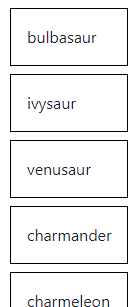
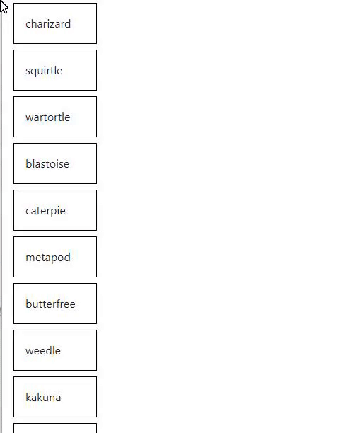
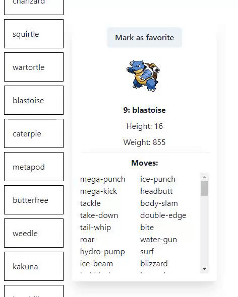

### The assignment

#### Task 1: Pokémon list

- Start by creating a component to show a list of Pokémon.
- You can use this endpoint for fetching the Pokémons: `https://pokeapi.co/api/v2/pokemon`.
- Make sure you add typings to the response of the API call. To show you exactly what we mean, we will give you the types for this API call for free:

```ts
interface PokemonList {
  count: number;
  next: string;
  previous: null;
  results: PokemonListItem[];
}

interface PokemonListItem {
  name: string;
  url: string;
}
```

- If you are using axios, you can use the type like this `axios.get<PokemonListResponse>(...)`.

You should have a list of Pokémon that looks like this.



#### Task 2: Pokémon detail

- Add the ability to click onto a list item so that a Pokémon can be viewed in detail.
- Create a component for showing the Pokémon in detail.
- You can use this endpoint for fetching a specific Pokémon: `https://pokeapi.co/api/v2/pokemon/{id or name}/`. The endpoint for each Pokémon is also included in the response of the Pokémon list from the previous task. You may use that one instead.
- The detail component should contain the following data:
  - Id of the Pokémon (`pokemon.id`)
  - Image of the Pokémon (`pokemon.sprites.front_default`)
  - Name of the Pokémon (`pokemon.name`)
  - Height and weight of the Pokémon (`pokemon.height` and `pokemon.weight`)
  - List of moves of the Pokémon (`pokemon.moves`)
- Don't forget to add your typings. Only add types for the properties that are requested! You don't have to fully type the response that the Pokémon API gives as that is too big (and useless) for this assignment.

You should now have a list with the ability to view each Pokémon in detail. The component should only pop up when a Pokémon is selected. If none is selected, the detail component should not show.



#### Task 3: Marking a Pokémon as favorite

- Add a button to the detail component to mark a Pokémon as favorite.
- When a Pokémon is marked as favorite, the list should show this visually (like a different colored background).
- The detail component should also contain an indication that the Pokémon is your favorite.
- You can only have 1 favorite pokemon at a time.

Once this is done, you should be able to mark a Pokémon as favorite and see this visually.



#### Task 4: Add an extra functionality that you can think of

- Try to impress us and add one extra functionality that wasn't mentioned in the assignment.
- This can be simple, or a bit more advanced, whatever you like! Show us your creativity!

### Final result

Once the following requirements are satisfied, your assignment is finished:

- Ability to fetch and view a list of Pokémons.
- Ability to fetch and view a Pokémon in detail which contains the Pokémon's id, image, name, height, weight and a list of the moves.
- Ability to mark a Pokémon as favorite and show this visually.
- 1 extra functionality that you thought of.
- Some basic styling.
- Everything committed to the git repo.

You are always free to make it look super fancy or add even more extra functionality, but this is not required.

### Deploy on Vercel

To finish your assignment, you will have to deploy this to Vercel. Deploying to vercel is super easy. You can simply connect your git repository to a vercel project and everything will automatically be build and deployed.

From the Next.JS docs:

> The easiest way to deploy your Next.js app is to use the [Vercel Platform](https://vercel.com/new?utm_medium=default-template&filter=next.js&utm_source=create-next-app&utm_campaign=create-next-app-readme) from the creators of Next.js.
> Check out our [Next.js deployment documentation](https://nextjs.org/docs/deployment) for more details.
